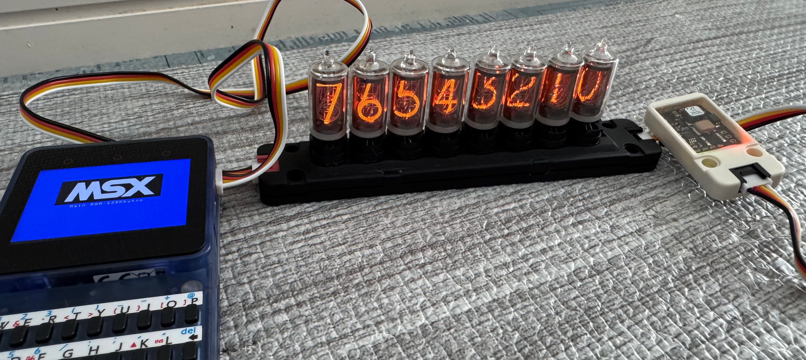
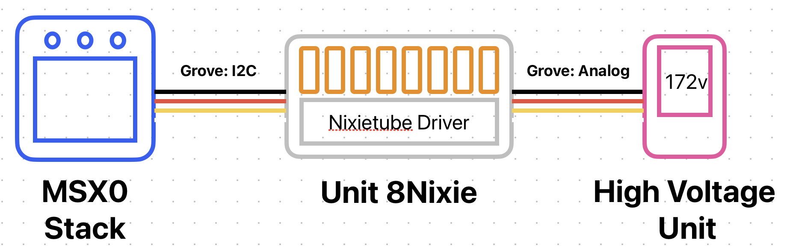

# Unit 8Nixie

An 8-digit Nixie Tube display unit controllable via I²C, designed in the M5Stack "Unit" form factor.  
It is operated from the MSX0 system using I²C commands and a BASIC interpreter.

## Features

- 8-digit Nixie tube display using JRC **B-5853S** tubes and SK-207 sockets  
  *(B-5853S was selected due to better compatibility with pulse-driven operation)*
- Controlled via **I²C** from **MSX0** (a derivative board based on M5Stack Core2 running MSX emulation)
- Includes an onboard controller (**ATtiny402**) to receive and process I²C commands
- Display driver ICs: **HV5523** and **HV513**
- External high-voltage generation unit (housed in UnitProto), connected via Grove port
- Fully compatible with the **M5Stack Unit** ecosystem, matching size and design

## System Block Diagram

## Contents

- [`/hardware`](https://github.com/Ninune-wa/Unit-8Nixie/tree/main/hardware) – STL files for the enclosure and Gerber files for PCB fabrication
- [`/firmware`](https://github.com/Ninune-wa/Unit-8Nixie/tree/main/firmware) – I²C firmware for ATtiny402 and MSX BASIC scripts for MSX0
- [`/docs`](https://github.com/Ninune-wa/Unit-8Nixie/tree/main/docs) – Block diagrams, assembly notes, and documentation

## Usage

1. Connect **MSX0 Stack Grove Port.A** to **Unit 8Nixie** via Grove I²C cable
2. Power the **High Voltage Unit** via Grove Analog port on Unit 8Nixie
3. Upload the MSX BASIC program on MSX0 to send display commands
4. Firmware on the onboard ATtiny402 interprets I²C commands and controls the HV5523/HV513 drivers
5. Nixie tubes are driven with pulsed high voltage for dynamic and low-power operation

See `/docs` for wiring diagrams and full usage instructions.

## License

MIT License. See [LICENSE](./LICENSE).
